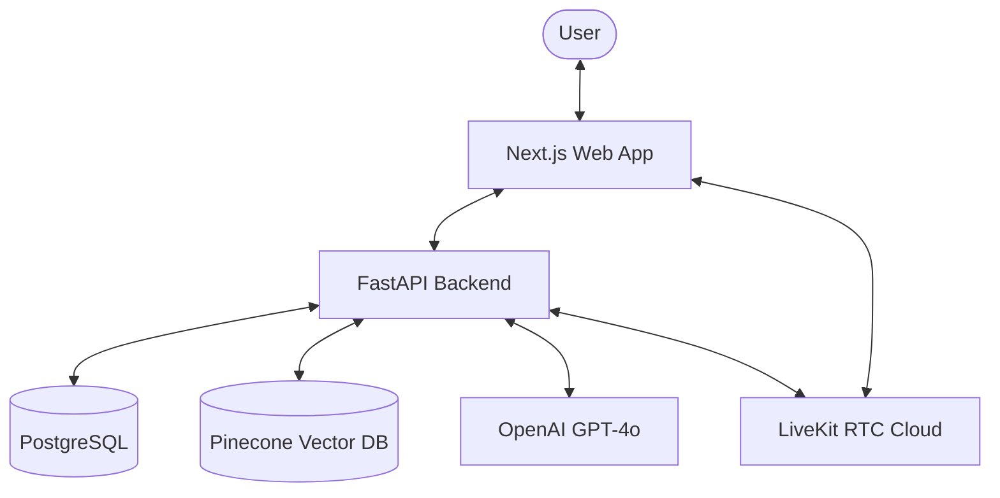

# 🏗️ EmpathAI Architecture

This document describes the high-level architecture and internal design of EmpathAI.

## 🌉 System Overview

EmpathAI follows a classic client-server architecture with several specialized components for AI and Real-Time Communication.

## 🧠 Neural Memory Registry (Memory System)

The heart of EmpathAI's empathy is its memory system. It consists of two layers:

### 1. Short-Term Context (Pinecone RAG)
Every message sent by the user and AI is vectorized and stored in Pinecone. Before generating a response, the system performs a semantic search to retrieve the most relevant past messages, providing "near-term recall."

### 2. Long-Term Facts (Extraction Layer)
The `MemoryService` asynchronously analyzes conversations to extract persistent facts (e.g., "User is a designer," "User has a dog named Max"). These are stored as structured `MemoryFact` records in PostgreSQL. This allows Luna to remember details even if they fall out of the immediate context window.

## 🏆 Relationship Bond System

The bond system is a logic layer that lives in `backend/app/services/memory_service.py`. It tracks a `bond_score` for each user.
- **Level Calculation**: `level = bond_score // 100 + 1`
- **Milestones**: Level-up events are detected by the backend and broadcast to the frontend via API responses or WebSocket signals.
- **Frontend Celebration**: The `RelationshipJourney.tsx` component uses Framer Motion and `AnimatePresence` to trigger a fireworks/toast celebration when a level-up occurs.

## 🎙️ Real-Time Communication (RTC)

EmpathAI uses **LiveKit** for high-performance audio and video calls.
- **Signaling**: The backend generates a secure `access_token` for the user and the AI.
- **Media**: Audio and video streams are handled by the LiveKit Selective Forwarding Unit (SFU).
- **Video Avatars**: During video calls, Luna is represented by a customizable animated mascot that reacts to the audio intensity.

## 🎨 UI/UX Design System

The application uses a custom-built design system called **"Cyberpunk Elegance"**.
- **Tokens**: Defined in `web/app/globals.css` using CSS variables (`--bg-base`, `--brand-500`, etc.).
- **Glassmorphism**: A heavily stylized use of `backdrop-filter: blur()` and semi-transparent borders to create a premium, depth-rich interface.
- **Theming**: Integrated with `next-themes` to support smooth transitions between Neon Dark and High-Contrast Light modes.

## 🔒 Security

- **Authentication**: All routes (frontend and backend) are protected by **Clerk**.
- **Environment Isolation**: Sensitive keys are never hardcoded and are managed through Docker environment variables.
